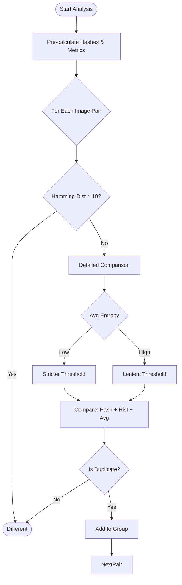

# Component Design: Analysis & Deduplication (`analyzer.py` & `scripts/image_dedup.py`)

## 1. Overview
This component is the "brain" of the operation, responsible for filtering out thousands of extracted frames to leave only the unique, high-quality slides. It employs computer vision techniques to detect duplicates, blank screens, and irrelevant content.

## 2. Modules

### 2.1. `analyzer.py` (Legacy/CLI)
Used primarily for the `--post-process` CLI flag. It implements standard SSIM (Structural Similarity Index) checks.
- **Key Features**:
    - `analyze_image_content`: Detects dark borders, face count, and entropy to guess if an image is a slide or a video feed.
    - `analyze_images_comprehensive`: Iterates through images and groups them based on visual similarity.

### 2.2. `scripts/image_dedup.py` (Advanced/Interactive)
The modern, robust engine used by the Web App's interactive curation. It is significantly more sophisticated.

## 3. `scripts/image_dedup.py` Design

### 3.1. Responsibilities
- **Duplicate Detection**: Uses Perceptual Hashing (pHash, dHash) + Histogram Comparison + Entropy-aware thresholds.
- **Blank/Non-Slide Detection**: Identifies blank screens, camera feeds, and low-information images.
- **Smart Cropping**: Detects and removes UI borders (browser chrome, video player controls).
- **OCR Verification**: Uses EasyOCR to "save" images that look blank but actually contain text.

### 3.2. Logic Flow (Deduplication)



### 3.3. Logic Flow (Blank Detection)

```mermaid
graph TD
    Start([Analyze Image]) --> Metrics[Calc: Variance, Entropy, Color Div]
    Metrics --> CheckBlank{Is Blank?}
    
    CheckBlank -->|Yes| OCR{Has Text? (EasyOCR)}
    CheckBlank -->|No| Keep([Keep])
    
    OCR -->|Yes| Keep
    OCR -->|No| Graphics{Has Lines/Charts?}
    
    Graphics -->|Yes| Keep
    Graphics -->|No| Discard([Mark as Blank])
```

### 3.4. Key Functions
- **`analyze_image_content(img)`**: Calculates a suite of metrics (variance, entropy, dominant intensity).
- **`find_blank_images(...)`**: The high-level driver for blank detection. It manages the pipeline of *Metrics -> OCR -> Graphics Check*.
- **`compare_images_smart(...)`**: The core comparison logic. It combines multiple signals (Hash distance, Histogram correlation) to decide if two images are duplicates.
- **`detect_ui_regions(...)`**: Heuristic-based detection of static UI bars at the top/bottom of images.

## 4. Dependencies
- **External**:
    - `opencv-python` (cv2): Image processing.
    - `Pillow` (PIL): Image IO.
    - `imagehash`: Perceptual hashing algorithms.
    - `easyocr`: Optical Character Recognition (optional but recommended).
    - `numpy`: Numerical operations.
    - `sklearn`: Cosine similarity (optional).
