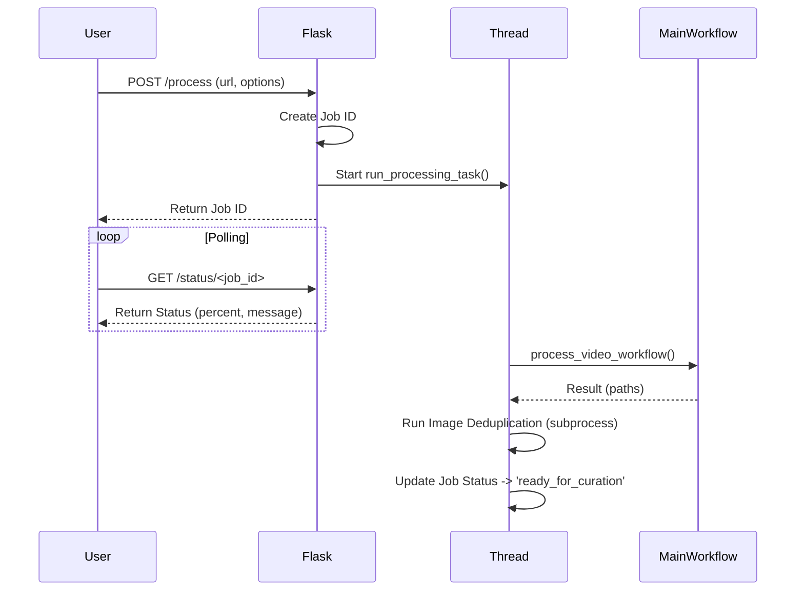
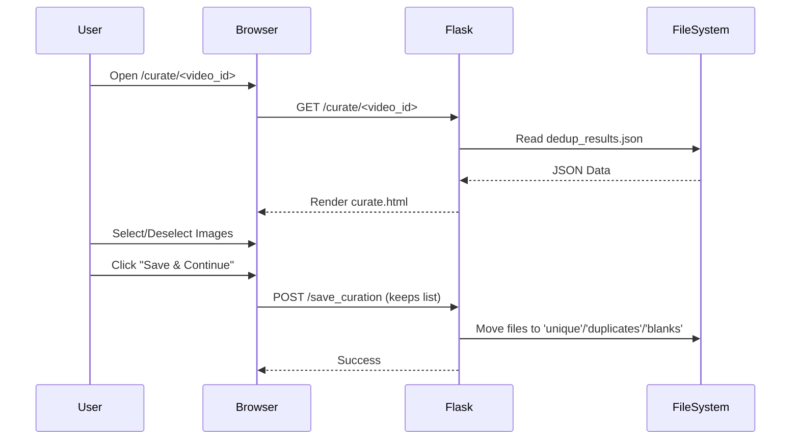

# Component Design: Web Application (`app.py`)

## 1. Overview
`app.py` provides a user-friendly web interface for the Video2PDF tool. It is built using Flask and allows users to manage projects, monitor progress, and crucially, perform interactive curation of extracted slides.

## 2. Responsibilities
- **Project Management**: List existing projects and their status.
- **Job Orchestration**: Run processing jobs in background threads (`threading`).
- **Progress Tracking**: Maintain a global `JOBS` dictionary to track status and logs.
- **Interactive Curation**: Serve a specialized UI (`curate.html`) for reviewing and selecting slides.
- **File Serving**: Serve generated images and documents to the browser.
- **API Endpoints**: JSON endpoints for frontend interaction (`/process`, `/status`, `/save_curation`).

## 3. Internal Logic Flow

### Job Processing Flow


### Curation Flow


## 4. Key Functions/Routes

### Routes
- **`index()` (`/`)**: Renders the main dashboard.
- **`list_videos()` (`/list_videos`)**: Scans `output/` directory and returns project metadata.
- **`process_video()` (`/process`)**: Initiates a new processing job.
- **`job_status(job_id)` (`/status/<job_id>`)**: Returns current job status.
- **`curate(video_id)` (`/curate/<video_id>`)**: Renders the curation interface.
- **`save_curation()` (`/save_curation`)**: Receives the list of kept images and reorganizes files.
- **`generate_pdf()` (`/generate`)**: Triggers final PDF/DOCX generation.

### Helper Functions
- **`run_processing_task(...)`**: The worker function running in a separate thread. It wraps `main.process_video_workflow` and handles the subsequent deduplication step.
- **`prepare_slides_data(video_id)`**: Syncs curated images with the transcript for the editing view.

## 5. Data Structures
- **`JOBS` (Global Dict)**:
    ```python
    {
        "job_1": {
            "status": "processing" | "analyzing" | "ready_for_curation" | "error",
            "message": "Current step description",
            "percent": 45,
            "log": ["line 1", "line 2"],
            "video_id": "Video Title"
        }
    }
    ```

## 6. Dependencies
- **Internal**:
    - `main.py`: For `process_video_workflow`.
    - `scripts/image_dedup.py`: For deduplication logic.
    - `pdf_generator.py`: For document creation.
    - `config.py`: Configuration.
- **External**:
    - `flask`: Web framework.
    - `threading`: Concurrency.
    - `json`, `shutil`, `os`: Utilities.

## 7. UI/UX
- **Dashboard**: Simple list of projects + "New Project" input.
- **Curation Interface**: Grid of images.
    - **Green Border**: Kept.
    - **Red Border**: Duplicate (discard).
    - **Yellow Border**: Blank (discard).
    - **Interactions**: Click to toggle state.
