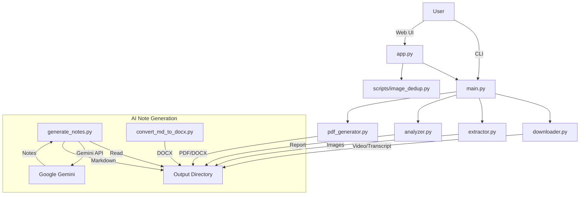

# Video2PDF Design Document

## 1. System Overview
Video2PDF is a tool designed to convert video content (specifically educational videos like YouTube tutorials) into concise, readable PDF or DOCX documents. It extracts key slides, synchronizes them with the transcript, and optionally generates AI-powered notes.

## 2. Architecture
The system follows a modular architecture with a clear separation of concerns:
- **Core Logic**: Python modules handling specific tasks (downloading, extraction, analysis, generation).
- **CLI Interface**: `main.py` for command-line execution and automation.
- **Web Interface**: `app.py` (Flask) for interactive workflows and visual curation.
- **AI Integration**: `generate_notes.py` uses Google's Gemini API for content summarization.

### High-Level Diagram


## 3. Key Components

### 3.1. Core Modules
- **`main.py`**: The central orchestrator. It parses arguments and executes the pipeline steps in order. [Detailed Design](design_main.md)
- **`app.py`**: A Flask-based web server that wraps the core logic. It provides endpoints for listing projects, starting jobs, checking status, and crucially, an interactive interface for curating slides (`curate.html`). [Detailed Design](design_app.md)
- **`downloader.py`**: Handles downloading videos and transcripts from YouTube using `yt-dlp`. [Detailed Design](design_downloader.md)
- **`extractor.py`**: Extracts frames from videos based on scene changes and similarity metrics (SSIM/Grid SSIM) to capture unique slides. [Detailed Design](design_extractor.md)
- **`analyzer.py`**: Performs basic post-processing analysis (legacy/simple method) to detect duplicates and irrelevant content. Used when `--post-process` is passed to CLI. [Detailed Design](design_analyzer.md)
- **`pdf_generator.py`**: Combines images and text into final PDF and DOCX documents. It handles layout and synchronization. [Detailed Design](design_pdf_generator.md)
- **`transcript.py`**: Manages transcript downloading and cleaning. [Detailed Design](design_downloader.md)
- **`utils.py`**: Utility functions for file handling, time parsing, etc.

### 3.2. AI & Notes Modules
- **`generate_notes.py`**: A standalone script (currently) that correlates slides with transcript segments and uses the Gemini API to generate structured notes. [Detailed Design](design_notes_gen.md)
- **`convert_md_to_docx.py`**: Converts the Markdown output from `generate_notes.py` into a formatted DOCX file. [Detailed Design](design_notes_gen.md)

### 3.3. Scripts
- **`scripts/image_dedup.py`**: Advanced image deduplication and blank detection logic. Uses perceptual hashing (phash, dhash), histogram comparison, and OCR. This is the primary engine for the **Interactive Curation** mode. [Detailed Design](design_analyzer.md)

## 4. Data Flow & Directory Structure
The system organizes data by project (Video Title) in the `output/` directory.

```
output/
└── [Video Title]/
    ├── video/                  # Original video file
    ├── images/                 # Extracted raw screenshots
    │   ├── organized_moderate/ # Curated folders (unique, duplicates, blanks)
    │   │   ├── unique/         # The final set of kept slides
    │   │   ├── duplicates/
    │   │   └── blanks/
    │   └── dedup_results.json  # Metadata about curation
    ├── transcripts/            # Raw and processed transcript files
    ├── [Video Title].pdf       # Final PDF Output
    ├── [Video Title].docx      # Final DOCX Output
    ├── generated_notes.md      # AI-generated notes (Markdown)
    └── generated_notes_full.docx # AI-generated notes (DOCX)
```

## 5. Workflows

### 5.1. Standard Pipeline (CLI/Web)
1.  **Input**: YouTube URL or local file.
2.  **Download**: Video and transcript are downloaded.
3.  **Extraction**: Frames are extracted based on difference thresholds.
4.  **Deduplication**:
    *   *Basic (CLI)*: `analyzer.py` flags duplicates using SSIM if `--post-process` is used.
    *   *Advanced (Interactive)*: `scripts/image_dedup.py` runs advanced analysis (hashing, OCR). User then reviews and selects slides via Web UI.
5.  **Generation**: PDF/DOCX is generated from the final set of images and transcript.

### 5.2. AI Notes Generation (Manual/Script)
1.  **Prerequisites**: Valid `output/` folder with `transcripts/` and `images/organized_moderate/unique/`.
2.  **Execution**: Run `generate_notes.py`.
3.  **Process**:
    *   Parses transcript and slide timestamps.
    *   Correlates text segments to slides.
    *   Sends each slide + text to Gemini API.
    *   Writes `generated_notes.md`.
4.  **Conversion**: Run `convert_md_to_docx.py` to get the final DOCX.

## 6. Future Improvements & TODOs
- [ ] Integrate `generate_notes.py` into the main `app.py` workflow.
- [ ] Improve configuration management (currently hardcoded API keys and paths in some scripts).
- [ ] Unified error handling and logging across all modules.
- [ ] Database integration for better job tracking (replacing in-memory `JOBS` dict).
