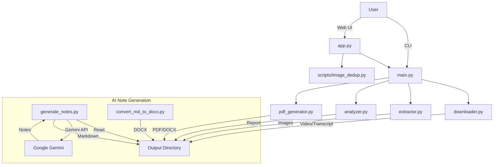

# Video2PDF Design Document

## 1. System Overview
Video2PDF is a tool designed to convert video content (specifically educational videos like YouTube tutorials) into concise, readable PDF or DOCX documents. It extracts key slides, synchronizes them with the transcript, and optionally generates AI-powered notes.

## 2. Architecture
The system follows a modular architecture with a clear separation of concerns:
- **Core Logic**: Python modules handling specific tasks (downloading, extraction, analysis, generation).
- **CLI Interface**: `main.py` for command-line execution and automation.
- **Web Interface**: `app.py` (Flask) for interactive workflows and visual curation.
- **AI Integration**: `generate_notes.py` uses Google's Gemini API for content summarization.

### High-Level Diagram

```mermaid
graph TD
    User[User] -->|CLI| Main[main.py]
    User -->|Web UI| App[app.py]
    
    Main --> Downloader[downloader.py]
    Main --> Extractor[extractor.py]
    Main --> Analyzer[analyzer.py]
    Main --> PDFGen[pdf_generator.py]
    
    App --> Main
    App --> ImageDedup[scripts/image_dedup.py]
    
    Downloader -->|Video/Transcript| Output[Output Directory]
    Extractor -->|Images| Output
    Analyzer -->|Report| Output
    PDFGen -->|PDF/DOCX| Output
    
    subgraph "AI Note Generation"
        GenNotes[generate_notes.py] -->|Read| Output
        GenNotes -->|Gemini API| AI[Google Gemini]
        AI -->|Notes| GenNotes
        GenNotes -->|Markdown| Output
        MDtoDocx[convert_md_to_docx.py] -->|DOCX| Output
    end
```

## 3. Key Components

### 3.1. Core Modules
- **`main.py`**: The central orchestrator. It parses arguments and executes the pipeline steps in order. [Detailed Design](design_main.md)
- **`app.py`**: A Flask-based web server that wraps the core logic. It provides endpoints for listing projects, starting jobs, checking status, and crucially, an interactive interface for curating slides (`curate.html`). [Detailed Design](design_app.md)
- **`downloader.py`**: Handles downloading videos and transcripts from YouTube using `yt-dlp`. [Detailed Design](design_downloader.md)
- **`extractor.py`**: Extracts frames from videos based on scene changes and similarity metrics (SSIM/Grid SSIM) to capture unique slides. [Detailed Design](design_extractor.md)
- **`analyzer.py`**: Performs basic post-processing analysis (legacy/simple method) to detect duplicates and irrelevant content. Used when `--post-process` is passed to CLI. [Detailed Design](design_analyzer.md)
- **`pdf_generator.py`**: Combines images and text into final PDF and DOCX documents. It handles layout and synchronization. [Detailed Design](design_pdf_generator.md)
- **`transcript.py`**: Manages transcript downloading and cleaning. [Detailed Design](design_downloader.md)
- **`utils.py`**: Utility functions for file handling, time parsing, etc.

### 3.2. AI & Notes Modules
- **`generate_notes.py`**: A standalone script (currently) that correlates slides with transcript segments and uses the Gemini API to generate structured notes. [Detailed Design](design_notes_gen.md)
- **`convert_md_to_docx.py`**: Converts the Markdown output from `generate_notes.py` into a formatted DOCX file. [Detailed Design](design_notes_gen.md)

### 3.3. Knowledge Ingestion System (`knowledge_ingest/`)
- **`knowledge_ingest/`**: A separate subsystem that transforms ICT trading-education sources (transcripts, PDFs, chart images) into a typed, searchable knowledge base via LanceDB. Uses Ollama LLM models for segment→classify→extract pipeline with ICT-aware prompts. See §7 and `knowledge_ingest/HANDOVER.md` for full documentation.

### 3.3. Scripts
- **`scripts/image_dedup.py`**: Advanced image deduplication and blank detection logic. Uses perceptual hashing (phash, dhash), histogram comparison, and OCR. This is the primary engine for the **Interactive Curation** mode. [Detailed Design](design_analyzer.md)

## 4. Data Flow & Directory Structure
The system organizes data by project (Video Title) in the `output/` directory.

```
output/
└── [Video Title]/
    ├── video/                  # Original video file
    ├── images/                 # Extracted raw screenshots
    │   ├── organized_moderate/ # Curated folders (unique, duplicates, blanks)
    │   │   ├── unique/         # The final set of kept slides
    │   │   ├── duplicates/
    │   │   └── blanks/
    │   └── dedup_results.json  # Metadata about curation
    ├── transcripts/            # Raw and processed transcript files
    ├── [Video Title].pdf       # Final PDF Output
    ├── [Video Title].docx      # Final DOCX Output
    ├── generated_notes.md      # AI-generated notes (Markdown)
    └── generated_notes_full.docx # AI-generated notes (DOCX)
```

## 5. Workflows

### 5.1. Standard Pipeline (CLI/Web)
1.  **Input**: YouTube URL or local file.
2.  **Download**: Video and transcript are downloaded.
3.  **Extraction**: Frames are extracted based on difference thresholds.
4.  **Deduplication**:
    *   *Basic (CLI)*: `analyzer.py` flags duplicates using SSIM if `--post-process` is used.
    *   *Advanced (Interactive)*: `scripts/image_dedup.py` runs advanced analysis (hashing, OCR). User then reviews and selects slides via Web UI.
5.  **Generation**: PDF/DOCX is generated from the final set of images and transcript.

### 5.2. AI Notes Generation (Manual/Script)
1.  **Prerequisites**: Valid `output/` folder with `transcripts/` and `images/organized_moderate/unique/`.
2.  **Execution**: Run `generate_notes.py`.
3.  **Process**:
    *   Parses transcript and slide timestamps.
    *   Correlates text segments to slides.
    *   Sends each slide + text to Gemini API.
    *   Writes `generated_notes.md`.
4.  **Conversion**: Run `convert_md_to_docx.py` to get the final DOCX.

## 6. Future Improvements & TODOs
- [ ] Integrate `generate_notes.py` into the main `app.py` workflow.
- [ ] Improve configuration management (currently hardcoded API keys and paths in some scripts).
- [ ] Unified error handling and logging across all modules.
- [ ] Database integration for better job tracking (replacing in-memory `JOBS` dict).

---

## 7. Knowledge Ingestion System (`knowledge_ingest/`)

### 7.1. Overview

The `knowledge_ingest/` package is a separate subsystem that transforms heterogeneous
ICT trading-education sources (video transcripts, markdown, PDFs, chart/diagram
images) into a typed, filterable, provenance-tracked knowledge base. It is designed
to feed a trading companion (setup retrieval, backtest validation, live analysis).

### 7.2. Architecture

```
SOURCES                     FRONT STAGE                    CORE PIPELINE
transcripts/.txt/.md  ──────────────────────────┐
text PDFs         ──► pdf_extract ───────────────┤
mixed PDFs/Slides ──► pdf_extract --mixed ──┬────┤──► segment → classify → extract
blogs             ──► blog_fetch ───────────┤    │   (typed KnowledgeUnit JSONL)
                                            │    │            │
chart/diagram images ───────────────────────┴────┼──► chart_extract (VLM propose
  (also from mixed-PDF/blog image pages)          │      → human verify → commit)
                                                  │            │
                                                  ▼            ▼
                                            units/*.jsonl (one store)
                                                  │
                            report_unmapped → grow vocab → recanonicalize
                                                  │
                                            build_lancedb → queryable vector store
```

### 7.3. Key Components

| Module | Purpose |
|---|---|
| `run.py` | Entry point: ingest, --build-vectors, --ict-aware flag |
| `config/config.py` | All tunables: models, paths, batch sizes, thresholds, ict_aware |
| `schema/models.py` | Pydantic v2 schemas: KnowledgeUnit, 6 payload types, provenance |
| `pipeline/ingest.py` | Orchestrator: segment→classify→extract, batched, resume, ICT-aware swapping |
| `pipeline/prompts.py` | Domain-agnostic prompt templates |
| `pipeline/ollama_client.py` | Ollama HTTP client, retry, robust JSON parse |
| `pipeline/vector_store.py` | LanceDB build + metadata-filtered semantic search |
| `sources/ict_text_prompts.py` | ICT-aware text pipeline prompts (drop-in replacements) |
| `sources/ict_chart_prompts.py` | ICT-aware chart extraction prompts (v4, classification-free) |
| `sources/pdf_extract.py` | Text PDFs + --mixed per-page router |
| `sources/blog_fetch.py` | Fetch → clean text + download images |
| `sources/chart_extract.py` | VLM chart → verify → unit |
| `vocab/ict_vocabulary.py` | 176 canonical ICT concepts + aliases |
| `merge_knowledge_base.py` | Unified LanceDB builder (chart + text units) |
| `mineru_integration.py` | MinerU PDF → image/text routing |

### 7.4. Knowledge Types

Every extracted unit is one of 6 typed categories, each with its own schema:

| Type | Description | Example |
|---|---|---|
| `setup` | Mechanical trade setup with entry/exit rules | "9:12 CSD short" |
| `contextual` | Calendar/regime anticipation | "Options expiry week sell-off" |
| `framework` | Analytical method / how-to | "Power of Three (Po3)" |
| `tip` | Heuristic / practical advice | "Move to BE if no expansion in 2 mins" |
| `psychology` | Trading mindset / discipline | "Dial back expectations after objective met" |
| `anecdote` | War story with embedded lesson | "Don't chase the entry" |

### 7.5. ICT-Aware Pipeline

The `--ict-aware` flag enables ICT domain-knowledge-embedded prompts that:
- Embed ICT framework context (Po3, MMXM, 7 Rules, sessions, macros)
- Reference the 176-concept canonical vocabulary
- Explain what each field means in ICT methodology
- A/B tested: 2.4x more units, 88% setup naming vs 33%, cleaner concept mapping

### 7.6. Vector Store

LanceDB with `nomic-embed-text` embeddings. Supports metadata-filtered semantic
search (by knowledge_type, session, testability, min_confidence).

### 7.7. Design Decisions

- **Typed knowledge, not prose blobs** — each unit has a schema, only `setup` and
  testable `contextual` flow toward backtest validation
- **Grounding discipline** — extraction fills only what's stated; inferences go in
  `inferred_fields`; per-unit `extraction_confidence`
- **Canonical vocabulary** — 176 ICT concepts with alias mapping; grow vocab anytime,
  re-canonicalize (cheap, idempotent), never re-extract (expensive)
- **Capture once** — provenance on every unit; idempotent recanonicalize
- **Charts: human-in-the-loop** — VLM proposes, human verifies
- **Schema reflects reality** — payload fields are Optional; `None` means "not
  provided"; `extraction_confidence` is the quality gate

### 7.8. Running the Knowledge Ingestion

```bash
# Text transcripts (ICT-aware)
python -m knowledge_ingest.run --input <transcripts> --output <out> --source-type transcript --ict-aware --no-skip

# Build vector store from existing units
python -m knowledge_ingest.run --build-vectors --units <dir1> <dir2> --db knowledge.lancedb

# Merge chart + text into unified LanceDB
python -m knowledge_ingest.merge_knowledge_base --transcript-dir <text_units_dir>

# MinerU PDF extraction
python -m knowledge_ingest.mineru_integration --pdf <path>
```

### 7.9. Querying the Knowledge Base (RAG)

The knowledge base exposes three interfaces for any LLM or client to query:

**CLI — ask a question with grounded answer:**
```bash
python -m knowledge_ingest.tests.ask_kb "What is the Sharp Turn entry model?"
python -m knowledge_ingest.tests.ask_kb "How does CSD work?" --sources
python -m knowledge_ingest.tests.ask_kb  # interactive REPL
```

**HTTP API server — any client can query:**
```bash
# Start server
python -m knowledge_ingest.serve --port 8900

# POST /ask    — RAG: retrieve + LLM synthesize
# POST /search — raw semantic search (no LLM)
# GET  /stats  — database statistics
# GET  /health — health check
```

**Python library — for scripts and agents:**
```python
from knowledge_ingest.tests.ask_kb import retrieve, format_context, synthesize
results = retrieve("What is CSD?", k=8)
answer = synthesize("What is CSD?", format_context(results))
```

The RAG pipeline: question → semantic search (LanceDB) → top-K units retrieved →
formatted as context → LLM synthesizes grounded answer with [Source N] citations.
Every claim traces to a specific knowledge unit with provenance (speaker, source,
confidence). The LLM model is configurable (default: deepseek-v4-flash:cloud).

See `knowledge_ingest/HANDOVER.md` §20 for full documentation.
