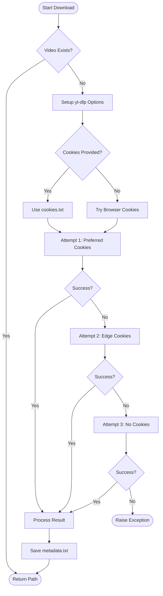
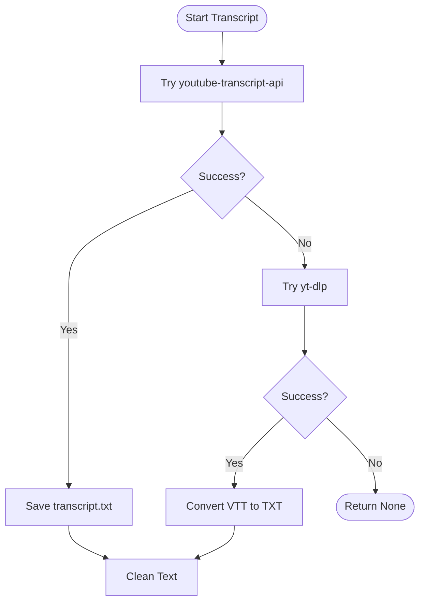

# Component Design: Ingestion Layer (`downloader.py` & `transcript.py`)

## 1. Overview
The ingestion layer is responsible for acquiring the raw media assets (video and text) from external sources, primarily YouTube. It consists of two main modules: `downloader.py` for video and `transcript.py` for subtitles.

## 2. `downloader.py`

### 2.1. Responsibilities
- **Video Download**: Fetches high-quality video streams using `yt-dlp`.
- **Cookie Management**: Handles YouTube authentication using `cookies.txt` or browser cookies to avoid age-restrictions or bot detection.
- **Metadata Extraction**: Saves video title and URL to `metadata.txt`.
- **Progress Reporting**: Provides hooks for progress bars in the UI.

### 2.2. Logic Flow

### 2.3. Key Functions
- **`download_youtube_video(url, output_dir, ...)`**: The main driver. Implements the 3-attempt retry logic (Preferred -> Edge -> Public).
- **`_process_download_result(...)`**: Helper to locate the downloaded file and write metadata.
- **`get_video_title(url)`**: Fast utility to fetch just the title without downloading.

## 3. `transcript.py`

### 3.1. Responsibilities
- **Transcript Download**: Fetches subtitles using `youtube-transcript-api` (preferred) or `yt-dlp` (fallback).
- **Format Conversion**: Converts VTT/SRT formats to a clean plain text format with timestamps.
- **Text Cleaning**: Removes filler words, overlapping captions, and noise.

### 3.2. Logic Flow

### 3.3. Key Functions
- **`download_youtube_transcript(...)`**: Orchestrates the download strategies.
- **`convert_vtt_to_txt(...)`**: Parses VTT files, handles timestamp parsing, and deduplicates overlapping time blocks.
- **`clean_transcript_text(...)`**: Advanced text processing.
    - Removes timestamps.
    - Removes filler words ("um", "uh").
    - Merges overlapping lines (common in auto-generated captions).
    - Groups sentences into paragraphs.

## 4. Dependencies
- **External**:
    - `yt_dlp`: Heavy lifting for downloads.
    - `youtube_transcript_api`: Specialized transcript fetching.
    - `ffmpeg` (via subprocess): For some format conversions.
