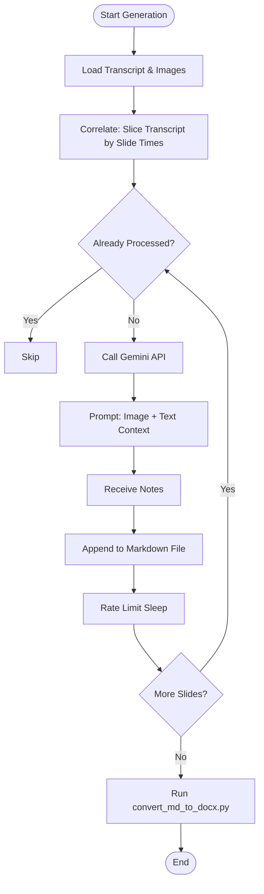

# Component Design: AI Notes Generation (`generate_notes.py`)

## 1. Overview
`generate_notes.py` is an experimental/standalone module that leverages Google's Gemini API to generate structured, educational notes from the extracted slides and transcript. It transforms the raw visual and textual data into a coherent study guide.

## 2. Responsibilities
- **Data Correlation**: Maps transcript segments to specific slides based on timestamps.
- **Prompt Engineering**: Constructs prompts for the Gemini API, instructing it to analyze both the image content and the accompanying text.
- **API Integration**: Handles communication with the Gemini API (rate limiting, error handling).
- **Markdown Generation**: Outputs the generated notes in a structured Markdown format.
- **DOCX Conversion**: Uses `convert_md_to_docx.py` to transform the Markdown into a polished Word document.

## 3. Internal Logic Flow

## 4. Key Functions

### `correlate_content(slides, transcript_entries)`
- **Logic**:
    1.  Iterates through slides sorted by time.
    2.  For slide `i` at time `T_i`, defines the relevant text window as `[T_i, T_{i+1})`.
    3.  Aggregates all transcript lines falling within this window.
    4.  Returns a list of objects containing `{slide_path, text_context}`.

### `generate_notes(model, content_list, output_file)`
- **Logic**:
    1.  Checks `output_file` to see which slides have already been processed (resumability).
    2.  Iterates through remaining slides.
    3.  Constructs a multimodal prompt:
        > "You are an expert note-taker... Analyze this slide and transcript... Output format: ## [Title]..."
    4.  Sends request to Gemini Flash model.
    5.  Appends result to file immediately (streaming-like persistence).

## 5. `convert_md_to_docx.py`
A helper script to format the raw Markdown into a DOCX.
- **Features**:
    - Renders images (re-embedding them from disk).
    - Formats headers, bullet points, and bold text.
    - Adds page breaks between slides.

## 6. Dependencies
- **External**:
    - `google-generativeai`: Gemini API client.
    - `python-docx`: Word document generation.
    - `Pillow` (PIL): Image handling.
- **Configuration**:
    - Requires `API_KEY` (currently hardcoded or env var).
